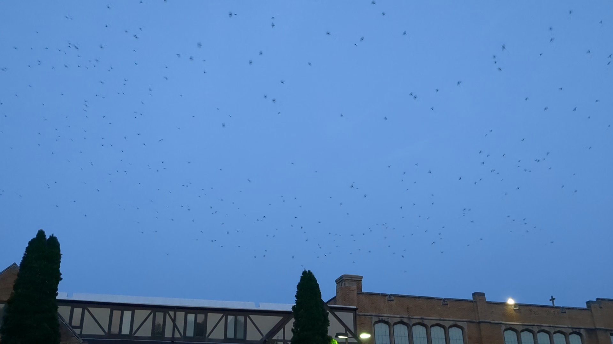
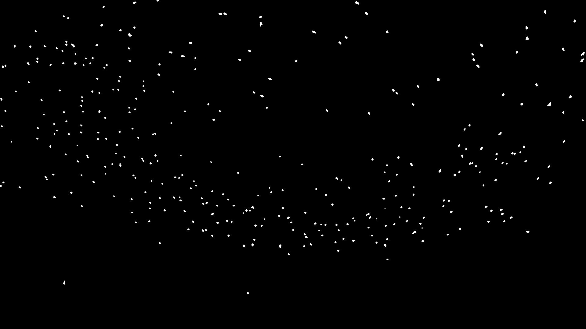
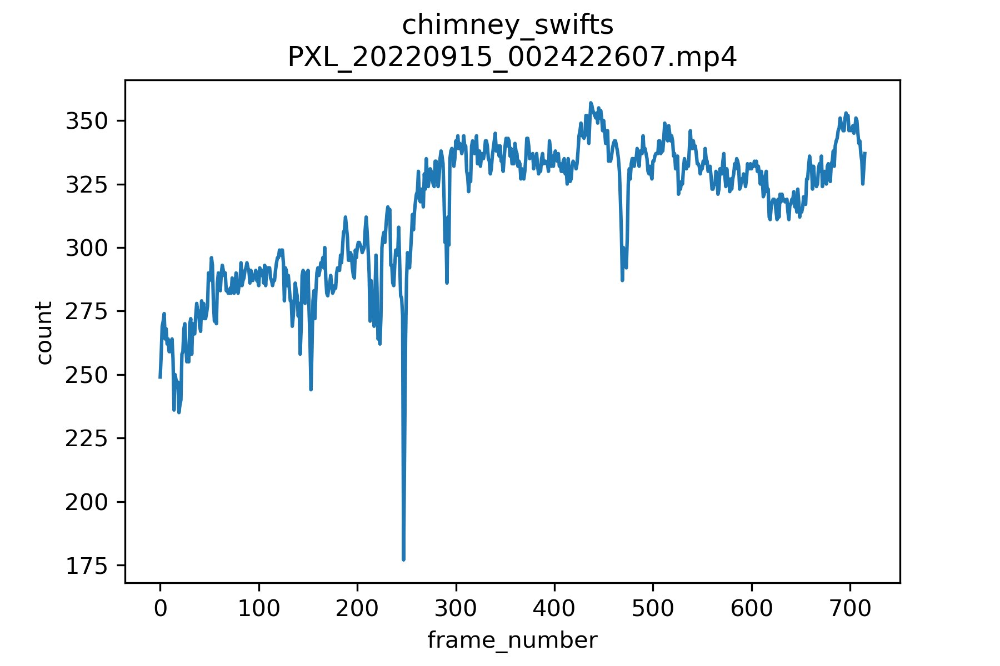

# CHIMNEY SWIFT COUNTER

It's pretty fascinating to watch the chimney swifts hang around the chimney before entering it. I made this simple script to estimate number of swifts flying within an mp4 video. It tries to exclude any buildings and large objects before computing the number of swifts.

> Note: this could probably be optimized as the function `threashold_otsu` takes a long time to compute optimal forward vs background threshold for a 1080p image. 

### Dependencies
* numpy
* tifffile
* skimage
* imageio
* matplotlib

Last frame in movie

Last Frame segmentation

Estimated number of swifts over the movie

 
